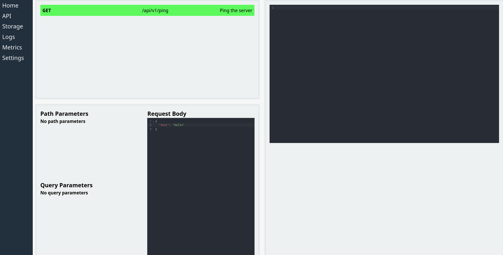

# courier

A work in progress SwaggerUI style admin dashboard.

## Current functionality

- A code editor w/ syntax highlighting for inputting request body. 
- Displays response in the right tab.

## Todo

- Parse an OpenAPI specification so that I don't have to manually define routes in the frontend.
- Implement the rest of the options for creating a request.
